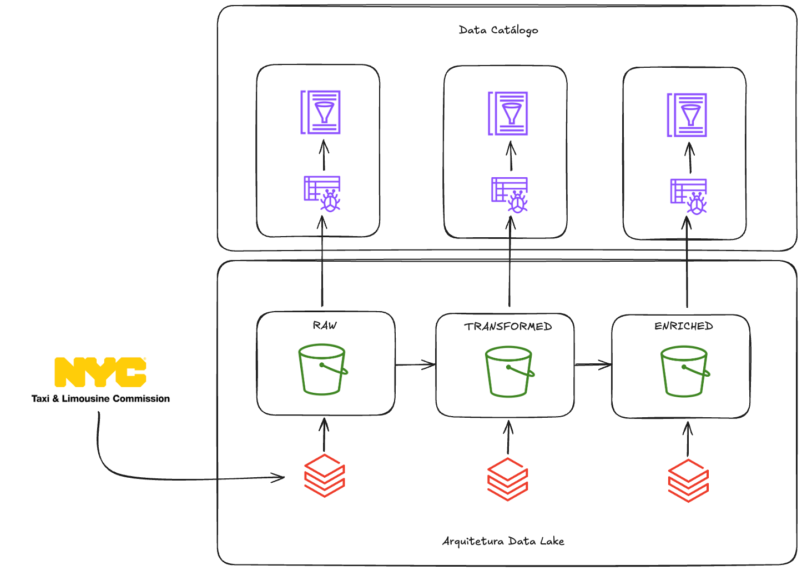
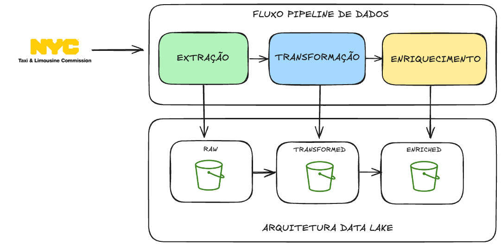
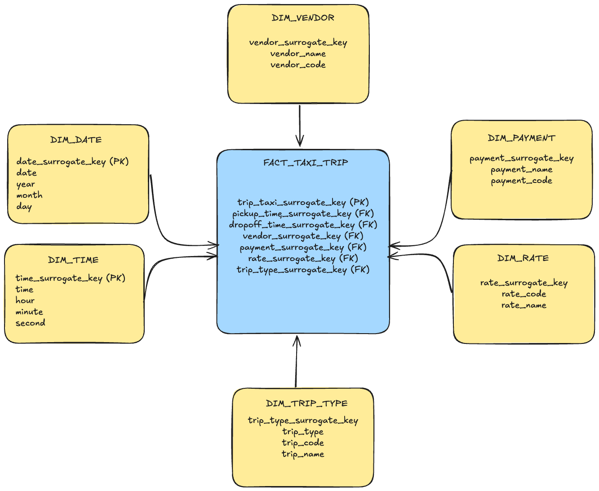

# case-data-architect-ifood

## Visão Geral
Este repositório contém um projeto de arquitetura de dados para um case do iFood, organizado em uma estrutura clara que segue boas práticas de engenharia de dados. O projeto utiliza PySpark para processamento de dados e está estruturado em camadas distintas.

## 1. Estrutura de Arquivos

### 1. Diretório `src/`
Contém todo o código fonte do projeto, organizado em subdiretórios por funcionalidade.

#### 1.1 `extraction/`
- **extraction.py**: Script principal para extração de dados
  - Implementa a classe `ExtractionTLCData` para download de dados públicos de táxi NYC
  - Conecta com S3 para armazenar os dados brutos
  - Possui métodos para:
    - Download de arquivos Parquet
    - Upload para bucket S3
    - Processamento em lotes por mês

#### 1.2 `transformation/`
- **transformation.py**: Processamento dos dados brutos
  - Classe `TransformedTLCData` realiza:
    - Conversão de tipos de dados
    - Padronização de nomes de colunas (para snake_case)
    - Criação de colunas temporais (year, month, day)
    - Filtragem por ano (2023)
  - Salva dados particionados por ano/mês

#### 1.3 `enriched/`
- **enriched.py**: Cria camada enriquecida
  - Classe `EnrichedTLCData`:
    - Seleciona colunas específicas para análise
    - Prepara dados para cálculo de métricas
    - Organiza em estrutura final

#### 1.4 `utils/`
- **utils.py**: Funções utilitárias compartilhadas
  - Contém helpers para:
    - Leitura de arquivos Parquet (`read_files_parquet`)
    - Escrita de arquivos Parquet (`save_file_parquet`)
  - Centraliza operações comuns de I/O

#### 1.5 `authentication/`
- **authentication.py**: Classe para autenticacao com S3 Bucket
  - Class `AuthenticationS3`.

---
## 2. Estrutura do Data Lake



- RAW (S3 Bucket):
    - Dados brutos originais da TLC 
    - Formato preservado como recebido
    - Particionamento por ano/mês/tipo

- TRANSFORMED (S3 Bucket):
    - Dados processados com Databricks
    - Schema validado e padronizado
    - Limpeza e enriquecimento inicial

- ENRICHED (S3 Bucket):
    - Dados prontos para análise
    - Agregações e métricas calculadas
    - Otimizados para consulta SQL

---

## 3. Fluxo de Processamento



O fluxo de execução da pipeline de dados é linear e segue três etapas sequenciais, representadas da esquerda para a direita:

1. **EXTRAÇÃO**:  
   - **Objetivo**: Coletar dados brutos de fontes diversas (bancos de dados, APIs, logs, etc.).  
   - **Saída**: Dados são armazenados na camada **RAW**, sem modificações, preservando a forma original.  

2. **TRANSFORMAÇÃO**:  
   - **Objetivo**: Processar os dados brutos (limpeza, filtragem, estruturação, normalização).  
   - **Saída**: Dados são movidos para a camada **TRANSFORMED**.  

3. **ENRIQUECIMENTO**:  
   - **Objetivo**: Adicionar valor aos dados (agregações, cálculos, integração com outras fontes).  
   - **Saída**: Dados são armazenados na camada **ENRICHED** (enriquecidos), prontos para consumo final (relatórios, ML, etc.).  

### **Características do Fluxo**:  
- **Sequencial**: Cada etapa depende da saída da anterior.  
- **Camadas de Armazenamento**: Cada fase tem uma camada dedicada (RAW → TRANSFORMED → ENRICHED).  
- **Contexto**: Executado em um **Data Lake**, que armazena os dados em todas as etapas.

### **Códigos da Pipeline**
1. **Extração**: `extraction.py` baixa dados de táxi NYC
2. **Transformação**: `transformation.py` limpa e estrutura os dados
3. **Enriquecimento**: `enriched.py` prepara para análise
4. **Utils**: Funções compartilhadas suportam todos os passos

---

## 4. Sugestão de Melhoria
1. Modelagem Dimensional
A modelagem dimensional dos dados do TLC Trip Record Data, conforme apresentada no esquema, segue a abordagem de Data Warehouse dimensional (estrela), o que traz várias vantagens para análise e criação de visualizações:



### **Vantagens da Modelagem Dimensional para Análise e Visualização**  

1. **Performance Otimizada**  
   - Consultas mais rápidas devido a joins simplificados entre fatos e dimensões.  
   - Agregações eficientes (ex.: total de corridas por mês).  

2. **Análise Temporal Facilitada**  
   - Filtros intuitivos por data, hora, dia da semana, etc.  
   - Drill-down natural (ex.: ano → mês → dia).  

3. **Visualizações Mais Ricas**  
   - Rótulos descritivos (ex.: "Cartão de Crédito" em vez de códigos).  
   - Hierarquias prontas para dashboards (ex.: tempo, localização).  

4. **Métricas Consistentes**  
   - KPIs calculados a partir de uma única fonte (tabela de fatos).  
   - Evita duplicação ou divergência em relatórios.  

5. **Flexibilidade Analítica**  
   - Combinações dinâmicas (ex.: "Viagens por tipo de pagamento × período do dia").  
   - Filtros cruzados (ex.: corridas noturnas pagas em dinheiro).  

6. **Dados Organizados e Confiáveis**  
   - Chaves substitutas garantem integridade (ex.: atualizações não quebram relatórios).  
   - Estrutura padronizada para escalabilidade.  

---

## 5. Como Executar
1. Instalar dependências: `pip install pyspark boto3 requests`
2. Configurar credenciais AWS (como variáveis de ambiente)
3. Executar scripts na ordem:
   ```bash
   python src/extraction/extraction.py
   python src/transformation/transformation.py
   python src/enriched/enriched.py
   ```
  ```text
  Nota: O código de extração, tranformação e enriquecimento já foram previamente executados para disponibilizar os dados para consumo
  ```

#### Configurando Ambiente para Consumo de Dados
Para acessar os dados armazenados no S3 Bucket através do Databricks, você precisará configurar os caminhos (paths) de acesso. Este processo requer as credenciais de segurança da AWS:

1. Credenciais necessárias:
   - `AWS_ACCESS_KEY`
   - `AWS_SECRET_KEY`

2. Obtenção das credenciais:
   - Utilize a classe `AuthenticationS3` desenvolvida nessa solução
   - Execute o código localmente para gerar as credenciais
   - Copie as credenciais exibidas para uso no Databricks

Exemplo de código para execução local:

```bash
from authentication.authentication import AuthenticationS3
import urllib

auth = eval(AuthenticationS3.get_secret_value())

access_key = auth["user-dl-case-ifood"]
secret_key = auth["secret-dl-case-ifood"]

print(access_key, secret_key)
```

Após obter as credenciais da AWS, execute o seguinte código no Databricks para configurar o acesso ao bucket S3:

```bash
import urllib
encoded_secret = urllib.parse.quote(string=secret_key, safe="")

aws_s3_bucket_raw = "raw-tlc-trip-data-case-ifood"
mount_name_raw = "/mnt/mount_raw"
source_url_raw = "s3a://%s:%s@%s" %(access_key, encoded_secret, aws_s3_bucket_raw)

aws_s3_bucket_transformed = "transformed-tlc-trip-data-case-ifood"
mount_name_transformed = "/mnt/mount_transformed"
source_url_transformed = "s3a://%s:%s@%s" %(access_key, encoded_secret, aws_s3_bucket_transformed)

aws_s3_bucket_enriched = "enriched-tlc-trip-data-case-ifood"
mount_name_enriched = "/mnt/mount_enriched"
source_url_enriched = "s3a://%s:%s@%s" %(access_key, encoded_secret, aws_s3_bucket_enriched)
```

A partir disso os dados podem ser consumidos pelo Databricks em qualquer camada (Raw, Tranformed, Enriched).

1. Exemplo de Leitura na camada Enriched:

```bash
def read_files_parquet(file_input):
   df = spark.read.parquet(file_input)
   return df

color_taxi = "yellow"
path_base_mount = "/mnt/mount_enriched/"
path_s3_bucket = f"{color_taxi}_taxi/metrics/taxi_trip/*.parquet"

df = read_files_parquet(path_base_mount + path_s3_bucket)
```

##### Consumir Dados S3 Local
Para consumir os dados em uma máquina local, basta somente ter acesso as credenciais e ler os dados `parquet` com alguma biblioteca que tenha suporte a esse tipo de arquivo.

---

## Análises - Resposta as perguntas
As análises feitas foram desenvolvidas para responders duas perguntas:

1. Qual a média de valor total (total_amount) recebido em um mês considerando todos os yellow táxis da frota?
2. Qual a média de passageiros (passenger\_count) por cada hora do dia que pegaram táxi no mês de maio considerando todos os táxis da frota?

O resultado para as perguntas estão no diretorio `analysis/`, no arquivo `perguntas.ipynb`.